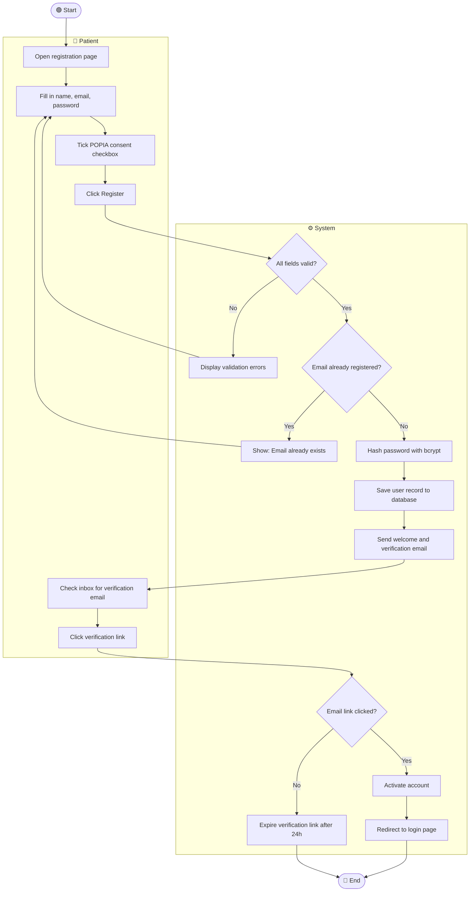
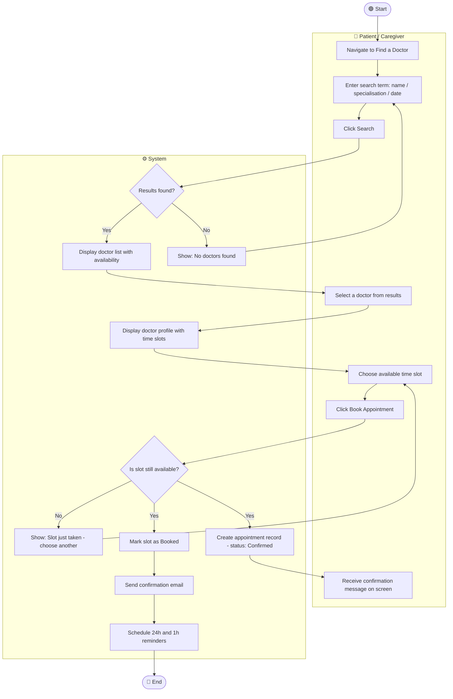
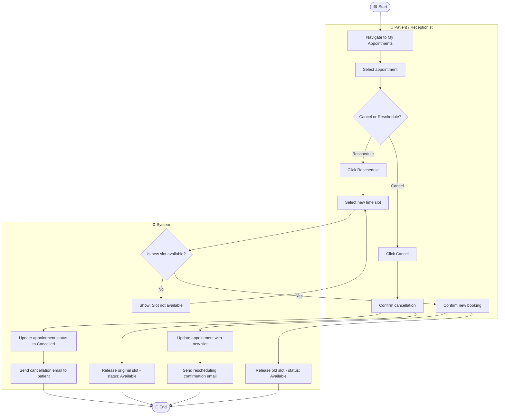
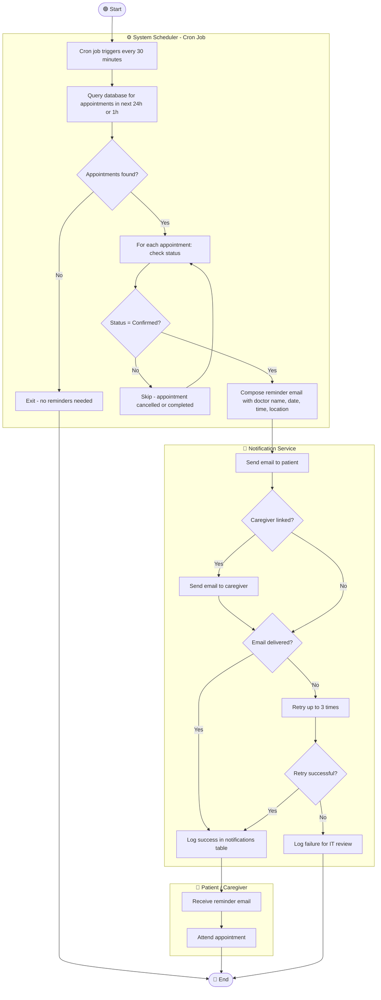
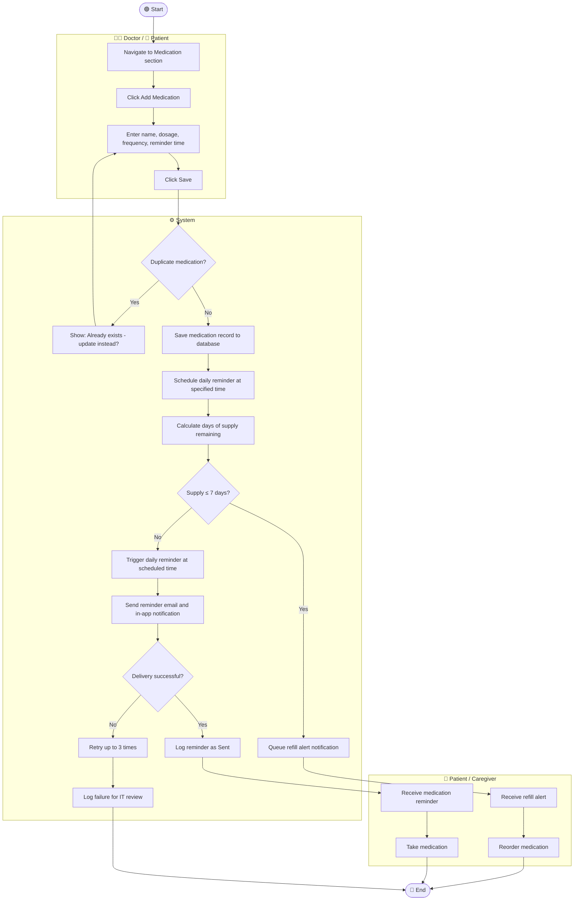
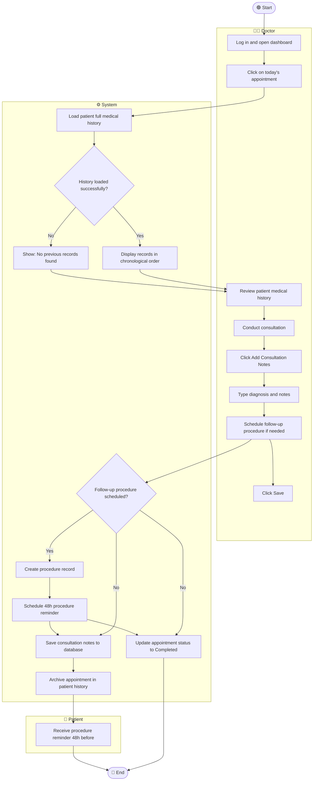
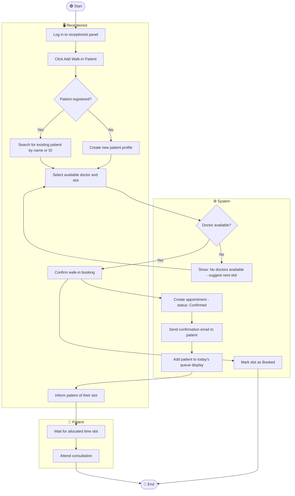
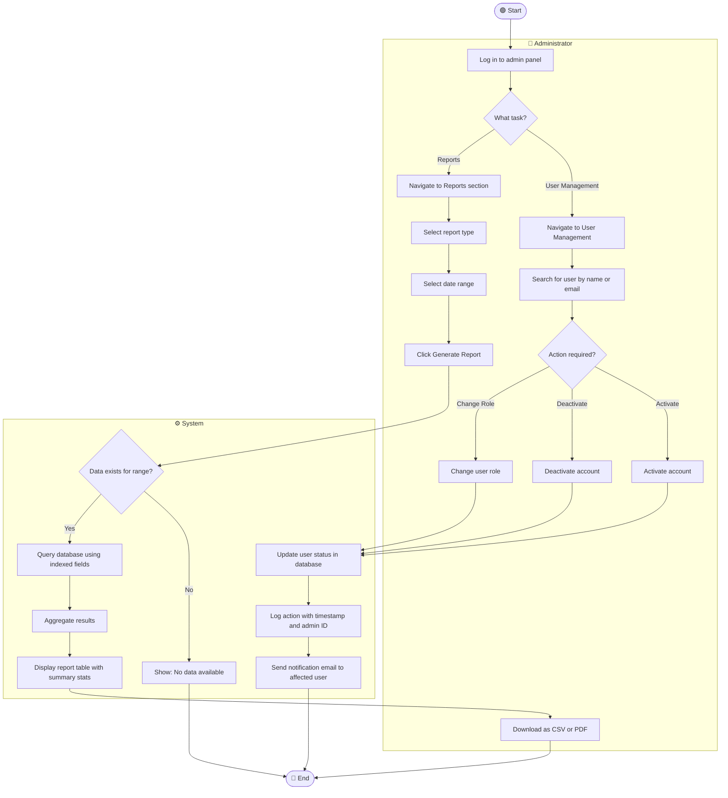

# ACTIVITY_DIAGRAMS.md – Activity Workflow Modeling

## ClinicEase Online Doctor Appointment Booking System

---

## Overview

This document models 8 critical workflows in ClinicEase using UML activity diagrams written in Mermaid. Each diagram includes start/end nodes, actions, decision points, parallel actions, and swimlanes showing which actor is responsible for each step.

---

## Workflow 1: Patient Registration

### Explanation
This workflow covers US-001 (FR-01). The parallel actions of saving the user record and sending the welcome email happen in sequence but the system handles both without patient input. Key decision points validate email format and check for duplicate accounts — addressing the IT staff concern about data integrity. The POPIA consent checkbox directly satisfies NFR-SEC3.

---

## Workflow 2: Doctor Search and Appointment Booking

### Explanation
This workflow covers US-003 and US-004 (FR-02, FR-03). The parallel actions after a confirmed booking — creating the appointment record, marking the slot as booked, sending confirmation email, and scheduling reminders — all happen simultaneously to ensure the fastest possible confirmation. This directly addresses the patient stakeholder's pain point of long queues and manual booking processes.

---

## Workflow 3: Appointment Cancellation and Rescheduling

### Explanation
This workflow covers US-005 (FR-04). The parallel actions on cancellation — updating the appointment status AND releasing the slot — must happen simultaneously to prevent any window where a slot appears booked but has no active appointment. This addresses the receptionist's concern about scheduling conflicts and overbooking.

---

## Workflow 4: Automated Appointment Reminder

### Explanation
This workflow covers US-006 (FR-05). The parallel sending to both patient and caregiver (when linked) satisfies the caregiver stakeholder concern about managing a dependent's healthcare remotely. The retry mechanism directly addresses NFR-P3 (cron job reliability). This workflow runs entirely without human intervention — the System/Scheduler swimlane handles all logic automatically.

---

## Workflow 5: Medication Reminder Setup and Delivery

### Explanation
This workflow covers US-007 (FR-06). The parallel tracks of daily reminder delivery and refill alert monitoring operate independently — the system calculates supply levels on every reminder cycle. This addresses the patient and caregiver stakeholder concerns about medication adherence, which was one of the most unique features of ClinicEase identified in the project description.

---

## Workflow 6: Doctor Consultation and Record Update

### Explanation
This workflow covers US-008, US-009, US-010 (FR-07, FR-08, FR-10). The parallel actions at the end — saving notes AND updating appointment status — ensure both the patient record and the appointment record are updated atomically. The swimlane separation shows that the patient only receives the outcome (procedure reminder) without being involved in the clinical documentation process.

---

## Workflow 7: Receptionist Walk-in Patient Management

### Explanation
This workflow covers US-011 (FR-09). The parallel actions of creating the appointment record and marking the slot as booked prevent any gap where double-booking could occur. The receptionist swimlane handles all decision-making while the system swimlane handles data operations — reflecting the real-world division of responsibility in a clinic environment. This addresses the receptionist's pain point of managing walk-ins alongside pre-booked patients.

---

## Workflow 8: Admin User Management and Report Generation

### Explanation
This workflow covers US-012 and US-013 (FR-11, FR-12). The two parallel tracks — user management and report generation — are both available from the same admin panel entry point. All admin actions are logged with timestamp and admin ID (shown in the System swimlane), satisfying the audit requirement identified in the Clinic Administrator stakeholder analysis from Assignment 4. Indexed database queries ensure reports generate within the performance threshold defined in NFR-S2.

---

## Traceability Summary

| Workflow | Functional Requirement | User Story | Sprint |
|---|---|---|---|
| Patient Registration | FR-01, NFR-SEC3 | US-001, US-002 | Sprint 1 |
| Doctor Search & Booking | FR-02, FR-03 | US-003, US-004 | Sprint 1 |
| Cancellation & Rescheduling | FR-04 | US-005 | Sprint 2 |
| Automated Appointment Reminder | FR-05 | US-006 | Sprint 2 |
| Medication Reminder Setup | FR-06 | US-007 | Sprint 2 |
| Doctor Consultation & Records | FR-07, FR-08, FR-10 | US-008, US-009, US-010 | Sprint 2 |
| Receptionist Walk-in Management | FR-09 | US-011 | Sprint 3 |
| Admin User Management & Reports | FR-11, FR-12 | US-012, US-013 | Sprint 3 |

---

*Document prepared by: [Sithembiso Lungisani Mthembu] | [222618698] | CPUT | March 2026*