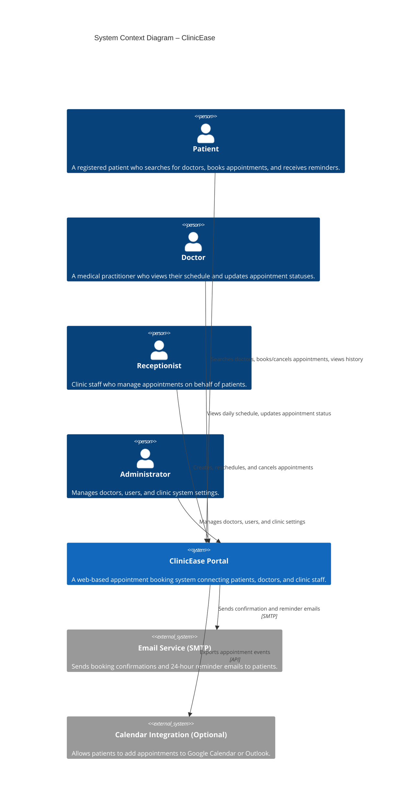
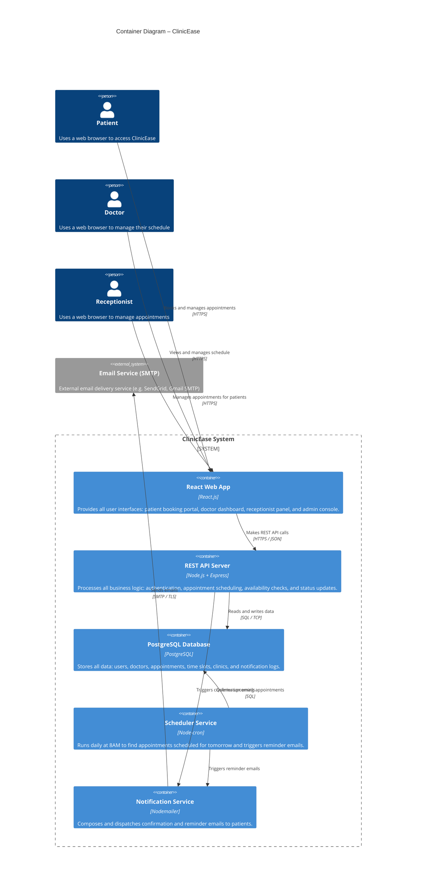
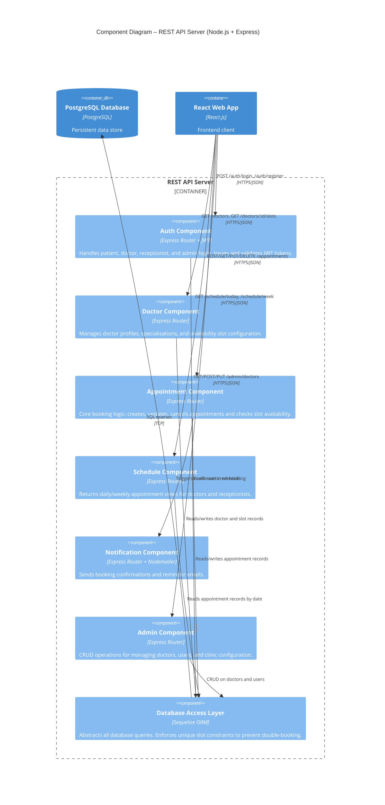
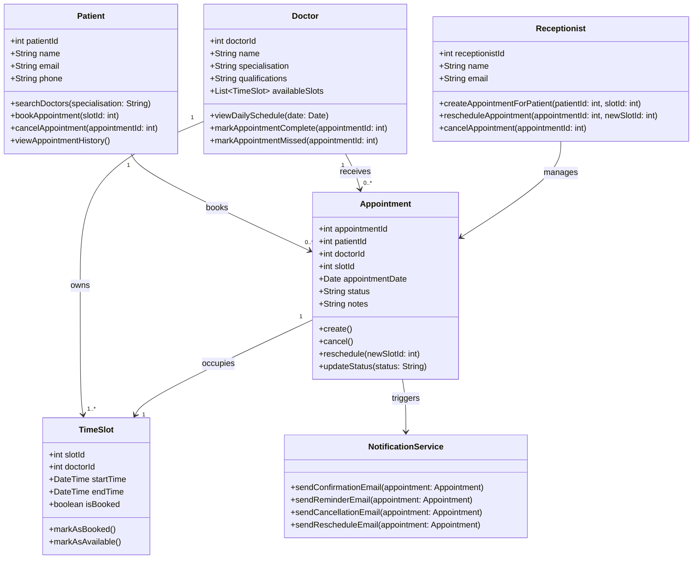

# ARCHITECTURE.md – ClinicEase Online Doctor Appointment Booking System

---

## Project Title
**ClinicEase – Online Doctor Appointment Booking System**

## Domain
**Healthcare / Medical Services**

## Problem Statement
Patients cannot book doctor appointments online, leading to long queues, overbooking, and missed appointments. ClinicEase provides a digital booking platform for patients, doctors, receptionists, and admins.

## Individual Scope
A web-based booking system built with React, Node.js, and PostgreSQL — fully feasible for individual development within one semester.

---

## C4 Architectural Diagrams

> All diagrams are written using [Mermaid](https://mermaid.js.org/) and render natively on GitHub.

---

## Level 1 – System Context Diagram

> Shows the key users and external systems that interact with ClinicEase.

---

## Level 2 – Container Diagram

> Shows the major containers (applications and data stores) that make up ClinicEase.

---

## Level 3 – Component Diagram (API Server)

> Shows the internal components of the Node.js REST API Server.

---

## Level 4 – Code Diagram (Appointment Module – Class Level)

> Shows the key classes and their relationships within the core Appointment booking module.

---

## End-to-End Component Summary

The table below maps every component from the user's browser all the way to the database and external services:

| Layer | Technology | Role |
|---|---|---|
| User (Browser) | Chrome / Firefox / Safari | Entry point for patients, doctors, receptionists, admins |
| Frontend | React.js | UI — booking portal, doctor dashboard, admin console |
| API Server | Node.js + Express | All business logic and REST API routing |
| Auth Module | JWT + bcrypt | Secure login and role-based access |
| Appointment Module | Express + Sequelize | Core booking, cancellation, rescheduling logic |
| Doctor Module | Express + Sequelize | Doctor profiles and availability slot management |
| Schedule Module | Express + Sequelize | Daily/weekly schedule views |
| Notification Module | Nodemailer | Email confirmations and reminders |
| Scheduler | Node-cron | Automated daily reminder job (runs at 8AM) |
| Database | PostgreSQL | All persistent data storage with slot uniqueness constraints |
| Email Service | SMTP (SendGrid / Gmail) | External email delivery |
| Calendar (Optional) | Google Calendar API | Patient calendar integration |

---

*Document prepared by: [Your Full Name] | [Your Student Number] | CPUT | March 2026*