# CLASS_DIAGRAM.md – Class Diagram in Mermaid.js

## ClinicEase Online Doctor Appointment Booking System

---

## Full Class Diagram

```mermaid
classDiagram

    %% ── BASE USER CLASS ──
    class User {
        -userId: String
        -name: String
        -email: String
        -passwordHash: String
        -role: String
        -status: String
        -createdAt: DateTime
        -lastLoginAt: DateTime
        +register() void
        +login() Boolean
        +logout() void
        +updateProfile() void
        +changePassword() void
        +deactivate() void
    }

    %% ── PATIENT ──
    class Patient {
        -patientId: String
        -dateOfBirth: Date
        -phone: String
        -address: String
        -medicalAidNumber: String
        -caregiverId: String
        +searchDoctors(query: String) List~Doctor~
        +bookAppointment(slotId: String) Appointment
        +cancelAppointment(appointmentId: String) void
        +rescheduleAppointment(appointmentId: String, newSlotId: String) Appointment
        +viewMedicalRecords() List~MedicalRecord~
        +addMedication(medication: MedicationReminder) void
        +requestDataDeletion() void
    }

    %% ── DOCTOR ──
    class Doctor {
        -doctorId: String
        -specialisation: String
        -qualifications: String
        -bio: String
        -profileStatus: String
        -clinicId: String
        +viewDailySchedule(date: Date) List~Appointment~
        +viewWeeklySchedule() List~Appointment~
        +updateConsultationNotes(appointmentId: String, notes: String) void
        +scheduleProcedure(patientId: String, procedure: Procedure) void
        +addMedicationForPatient(patientId: String, med: MedicationReminder) void
        +setAvailability(slots: List~TimeSlot~) void
        +blockSlot(slotId: String) void
    }

    %% ── RECEPTIONIST ──
    class Receptionist {
        -receptionistId: String
        -clinicId: String
        +createAppointmentForPatient(patientId: String, slotId: String) Appointment
        +rescheduleAppointment(appointmentId: String, newSlotId: String) Appointment
        +cancelAppointment(appointmentId: String) void
        +addWalkInPatient(patientId: String) void
        +searchPatient(query: String) Patient
    }

    %% ── ADMINISTRATOR ──
    class Administrator {
        -adminId: String
        -clinicId: String
        +createDoctorProfile(doctor: Doctor) void
        +deactivateUser(userId: String) void
        +activateUser(userId: String) void
        +changeUserRole(userId: String, role: String) void
        +generateReport(type: String, dateRange: DateRange) Report
        +viewAuditLogs() List~AuditLog~
    }

    %% ── APPOINTMENT ──
    class Appointment {
        -appointmentId: String
        -patientId: String
        -doctorId: String
        -slotId: String
        -status: String
        -createdAt: DateTime
        -updatedAt: DateTime
        -notes: String
        +confirm() void
        +cancel() void
        +reschedule(newSlotId: String) void
        +markInProgress() void
        +markCompleted(notes: String) void
        +markNoShow() void
        +sendConfirmationEmail() void
        +scheduleReminders() void
    }

    %% ── TIME SLOT ──
    class TimeSlot {
        -slotId: String
        -doctorId: String
        -startTime: DateTime
        -endTime: DateTime
        -status: String
        -durationMinutes: Int
        +markReserved() void
        +markBooked() void
        +markAvailable() void
        +markBlocked() void
        +markExpired() void
        +isAvailable() Boolean
    }

    %% ── MEDICAL RECORD ──
    class MedicalRecord {
        -recordId: String
        -patientId: String
        -doctorId: String
        -appointmentId: String
        -consultationDate: DateTime
        -diagnosis: String
        -notes: String
        -prescriptions: List~String~
        -status: String
        +addConsultationNotes(notes: String) void
        +addTestResult(result: TestResult) void
        +addPrescription(prescription: String) void
        +archive() void
        +requestDeletion() void
        +getFullHistory() List~MedicalRecord~
    }

    %% ── TEST RESULT ──
    class TestResult {
        -testResultId: String
        -recordId: String
        -testName: String
        -testDate: Date
        -result: String
        -fileUrl: String
        -uploadedBy: String
        +upload(file: File) void
        +getResult() String
    }

    %% ── MEDICATION REMINDER ──
    class MedicationReminder {
        -reminderId: String
        -patientId: String
        -medicationName: String
        -dosage: String
        -frequencyPerDay: Int
        -reminderTimes: List~Time~
        -startDate: Date
        -endDate: Date
        -supplyDays: Int
        -status: String
        +schedule() void
        +pause() void
        +resume() void
        +cancel() void
        +calculateDaysRemaining() Int
        +triggerReminder() void
        +sendRefillAlert() void
    }

    %% ── PROCEDURE ──
    class Procedure {
        -procedureId: String
        -patientId: String
        -doctorId: String
        -procedureName: String
        -scheduledDate: DateTime
        -preparationNotes: String
        -status: String
        +schedule() void
        +cancel() void
        +sendReminder() void
    }

    %% ── NOTIFICATION ──
    class Notification {
        -notificationId: String
        -recipientId: String
        -type: String
        -channel: String
        -status: String
        -message: String
        -sentAt: DateTime
        -retryCount: Int
        +send() void
        +retry() void
        +markDelivered() void
        +markRead() void
        +markFailed() void
        +archive() void
    }

    %% ── REPORT ──
    class Report {
        -reportId: String
        -generatedBy: String
        -type: String
        -dateRange: String
        -data: String
        -generatedAt: DateTime
        +generate() void
        +exportCSV() File
        +exportPDF() File
    }

    %% ── AUDIT LOG ──
    class AuditLog {
        -logId: String
        -adminId: String
        -action: String
        -targetUserId: String
        -timestamp: DateTime
        -details: String
        +record() void
        +getLogsByAdmin(adminId: String) List~AuditLog~
    }

    %% ══════════════════════════════════
    %% RELATIONSHIPS
    %% ══════════════════════════════════

    %% Inheritance (User is base class)
    User <|-- Patient : extends
    User <|-- Doctor : extends
    User <|-- Receptionist : extends
    User <|-- Administrator : extends

    %% Doctor owns TimeSlots (Composition — slots cannot exist without a doctor)
    Doctor "1" *-- "1..*" TimeSlot : owns

    %% TimeSlot holds at most one Appointment (Association)
    TimeSlot "1" -- "0..1" Appointment : holds

    %% Patient books many Appointments (Association)
    Patient "1" -- "0..*" Appointment : books

    %% Doctor receives many Appointments (Association)
    Doctor "1" -- "0..*" Appointment : receives

    %% Patient has MedicalRecords (Aggregation — records outlive appointments)
    Patient "1" o-- "1..*" MedicalRecord : has

    %% Doctor writes MedicalRecords (Association)
    Doctor "1" -- "0..*" MedicalRecord : writes

    %% MedicalRecord contains TestResults (Composition)
    MedicalRecord "1" *-- "0..*" TestResult : contains

    %% Patient owns MedicationReminders (Composition)
    Patient "1" *-- "0..*" MedicationReminder : manages

    %% Doctor schedules Procedures (Association)
    Doctor "1" -- "0..*" Procedure : schedules

    %% Patient has Procedures (Association)
    Patient "1" -- "0..*" Procedure : undergoes

    %% Appointment triggers Notifications (Aggregation)
    Appointment "1" o-- "0..*" Notification : triggers

    %% MedicationReminder triggers Notifications (Aggregation)
    MedicationReminder "1" o-- "0..*" Notification : triggers

    %% Procedure triggers Notifications (Aggregation)
    Procedure "1" o-- "0..*" Notification : triggers

    %% Receptionist manages Appointments (Association)
    Receptionist "1" -- "0..*" Appointment : manages

    %% Administrator generates Reports (Association)
    Administrator "1" -- "0..*" Report : generates

    %% Administrator creates AuditLogs (Composition)
    Administrator "1" *-- "0..*" AuditLog : creates
```

---

## Key Design Decisions

### Decision 1: Inheritance over Composition for User Roles
The four user roles (Patient, Doctor, Receptionist, Administrator) all inherit from a base `User` class rather than being implemented as separate unrelated classes. This avoids duplicating common attributes like `email`, `passwordHash`, and `status` across four classes. The role-specific attributes and methods are only defined in the subclass where they are relevant. This maps directly to FR-12 (Role-Based Access Control) and the `role` field on the base User class.

### Decision 2: Composition for Doctor → TimeSlot
The relationship between Doctor and TimeSlot is **composition** (filled diamond) because a TimeSlot cannot exist independently of a Doctor. If a Doctor's profile is deleted, all their TimeSlots are deleted with them. This is stronger than aggregation and enforces the business rule that slots are always owned by exactly one doctor.

### Decision 3: Aggregation for Patient → MedicalRecord
The relationship between Patient and MedicalRecord is **aggregation** (open diamond) rather than composition because MedicalRecords must survive even when a Patient account is deactivated or archived. This supports POPIA compliance — records are retained for a period after account deactivation before being purged, as modeled in the MedicalRecord state diagram (Assignment 8).

### Decision 4: Separate Notification Class
Rather than embedding notification logic in Appointment, MedicationReminder, and Procedure directly, a dedicated `Notification` class handles all delivery, retry, and archiving logic. This avoids duplication of SMTP error handling and retry logic across three different classes. It also allows the IT staff to monitor all notification failures from a single source.

### Decision 5: AuditLog as Composition under Administrator
AuditLog is modeled as a composition under Administrator because every log entry is created by an admin action and is meaningless without the context of the admin who created it. This supports the clinic administrator's requirement for full audit trails (FR-11 acceptance criteria).

### Decision 6: Report as a Separate Class
Rather than generating reports as raw database queries, the `Report` class encapsulates the report generation logic and provides `exportCSV()` and `exportPDF()` methods. This makes the reporting feature extensible — new report types can be added without modifying the Administrator class.

---

## Alignment with Prior Assignments

| Class | State Diagram (A8) | Activity Diagram (A8) | Use Case (A5) | Requirement (A4) |
|---|---|---|---|---|
| Appointment | ✅ Full lifecycle modeled | ✅ Booking + Cancellation workflows | UC-03, UC-04 | FR-03, FR-04 |
| User / Patient | ✅ Account states modeled | ✅ Registration workflow | UC-01 | FR-01 |
| Doctor | ✅ Profile states modeled | ✅ Consultation workflow | UC-07 | FR-08, FR-10 |
| TimeSlot | ✅ Slot states modeled | ✅ Booking workflow | UC-03 | FR-03 |
| MedicalRecord | ✅ Record lifecycle modeled | ✅ Consultation workflow | UC-07 | FR-10 |
| MedicationReminder | ✅ Reminder states modeled | ✅ Medication workflow | UC-06 | FR-06 |
| Notification | ✅ Notification states modeled | ✅ Reminder + Booking workflows | UC-05 | FR-05, FR-06 |

---

*Document prepared by: [Sithembiso Lungisani Mthembu] | [222618698] | CPUT | March 2026*