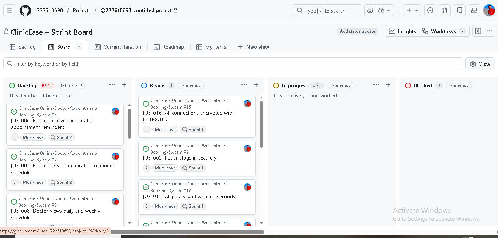

# 🏥 ClinicEase – Online Doctor Appointment Booking System

## Project Description

**ClinicEase** is a web-based clinic appointment booking system designed to simplify how patients schedule, manage, and track their medical care — all from their phone or computer. The system connects patients with doctors at local clinics, allowing online booking, cancellations, and smart reminders, eliminating the need for long queues, paper folders, and phone-based scheduling.

### 🌍 The Problem It Solves

In many South African clinics, patients carry thick paper files, wait in long queues just to be seen, and often forget when to take their medication or when their next appointment is. ClinicEase replaces all of that with a smart, paperless digital system.

### ✅ What ClinicEase Will Do

**📅 Online Appointment Booking**
Patients who are feeling sick can book an appointment from home before even leaving the house — no more arriving at the clinic and waiting for hours just to get a slot. Book your time, arrive when it's your turn, and go home faster.

**💊 Medication Reminders**
The system will send the patient a notification reminding them when it is time to take their medication. No more forgetting doses — whether it is morning tablets, afternoon pills, or chronic medication that must be taken every day.

**🩸 Procedure & Test Reminders**
If a patient needs to come back to the clinic for blood tests, blood pressure checks, or any follow-up procedure, the system will automatically notify them when their next test is due. For example: *"Your next blood draw is scheduled for Friday at 9AM — please fast from midnight."*

**📂 Paperless Patient Records**
Instead of carrying a paper file every visit, all patient information — diagnosis history, medication prescribed, test results, and appointment records — is stored digitally in the system. This reduces lost files, saves time at the reception desk, and makes it easier for doctors to view a patient's history instantly.

**🔔 Smart Notifications**
Patients receive reminders for:
- Upcoming appointments (24 hours and 1 hour before)
- Medication times throughout the day
- Follow-up procedures like blood tests or injections
- When chronic medication is about to run out and needs a refill

**👨‍⚕️ Doctor & Receptionist Dashboard**
Doctors can view their full daily schedule digitally, update patient notes after each visit, and flag patients who need follow-up care. Receptionists can manage the queue, add walk-in patients, and reschedule appointments — all without touching a paper file.

---

## 📂 Project Documents

### Assignment 3 — System Specification & Architecture
| Document | Description |
|---|---|
| [SPECIFICATION.md](./SPECIFICATION.md) | Full system specification including domain, problem statement, scope, and requirements |
| [ARCHITECTURE.md](./ARCHITECTURE.md) | C4 architectural diagrams: Context, Container, Component, Code levels + Data Flow Diagram |

### Assignment 4 — Stakeholder & System Requirements
| Document | Description |
|---|---|
| [STAKEHOLDERS.md](./STAKEHOLDERS.md) | 7 stakeholders with detailed roles, concerns, pain points, and success metrics |
| [SRD.md](./SRD.md) | System Requirements Document — 12 functional + 14 non-functional requirements with acceptance criteria |
| [REFLECTION.md](./REFLECTION.md) | Challenges faced in balancing stakeholder needs during requirements elicitation |

### Assignment 5 — Use Case Modelling & Test Cases
| Document | Description |
|---|---|
| [USE_CASE_DIAGRAM.md](./USE_CASE_DIAGRAM.md) | UML use case diagram (Mermaid) with 7 actors, 19 use cases, include relationships and written explanation |
| [USE_CASE_SPECS.md](./USE_CASE_SPECS.md) | 8 detailed use case specifications with preconditions, postconditions, basic and alternative flows |
| [TEST_CASES.md](./TEST_CASES.md) | 15 functional test cases + 3 non-functional test cases (performance, security, scalability) |
| [REFLECTION_A5.md](./REFLECTION_A5.md) | Challenges in translating requirements into use cases and test cases |

### Assignment 6 — Agile Planning, Backlog & Sprint
| Document | Description |
|---|---|
| [AGILE_PLANNING.md](./AGILE_PLANNING.md) | 18 user stories, MoSCoW backlog, Sprint 1 goal, task breakdown, and GitHub setup guide |
| [REFLECTION_A6.md](./REFLECTION_A6.md) | Challenges in Agile prioritisation, estimation, and playing dual Scrum roles solo |

### Assignment 7 — GitHub Kanban Board
| Document | Description |
|---|---|
| [template_analysis.md](./template_analysis.md) | Comparison of 4 GitHub templates with justification for Team Planning selection |
| [kanban_explanation.md](./kanban_explanation.md) | Kanban board definition, column structure, WIP limits, and Agile alignment |
| [KANBAN_SETUP.md](./KANBAN_SETUP.md) | Step-by-step guide to setting up the GitHub Project board with custom columns and fields |
| [reflection.md](./reflection.md) | Lessons learned in template selection and comparison with Trello and Jira |

## 📊 Kanban Board
> See the live board on the [GitHub Projects tab](../../projects)

ClinicEase uses a customised GitHub Project board based on the **Team Planning** template.

### Custom Columns Added

| Column | Reason Added |
|---|---|
| **Testing** | Ensures all features are validated against TEST_CASES.md before being marked Done. No feature moves to Done without passing its acceptance criteria test. |
| **Blocked** | Makes task dependencies visible. When a task cannot proceed (e.g., waiting for an API endpoint before building the UI), it moves to Blocked rather than cluttering the In Progress column. |

### WIP Limits

| Column | WIP Limit |
|---|---|
| In Progress | 3 |
| In Review | 3 |
| Testing | 3 |
| Blocked | 3 |

### Labels Used

| Label | Colour | Meaning |
|---|---|---|
| `must-have` | Red | Core MVP feature — Sprint 1 or 2 |
| `should-have` | Orange | Important but not MVP-blocking |
| `could-have` | Yellow | Nice to have — Sprint 4+ |
| `user-story` | Blue | Functional feature story |
| `non-functional` | Purple | Performance, security, or scalability story |
| `sprint-1` | Green | Assigned to Sprint 1 |
| `bug` | Dark Red | Defect discovered during testing |

### Traceability

Every card on the board links to a GitHub Issue (US-001 to US-018) which links to:
- A functional or non-functional requirement in **SRD.md** (Assignment 4)
- A use case in **USE_CASE_SPECS.md** (Assignment 5)
- A sprint plan entry in **AGILE_PLANNING.md** (Assignment 6)
---

## 🛠️ Tech Stack (Planned)

- **Frontend:** React.js
- **Backend:** Node.js + Express
- **Database:** PostgreSQL
- **Authentication:** JWT + bcrypt
- **Notifications:** Nodemailer (SMTP)
- **Hosting:** Render / Railway

---

## 👤 Author

**[Sithembiso Lungisani Mthembu]**
Student Number: [222618698]
Cape Peninsula University of Technology
Module: Software Engineering – Assignment 3
Date: March 2026