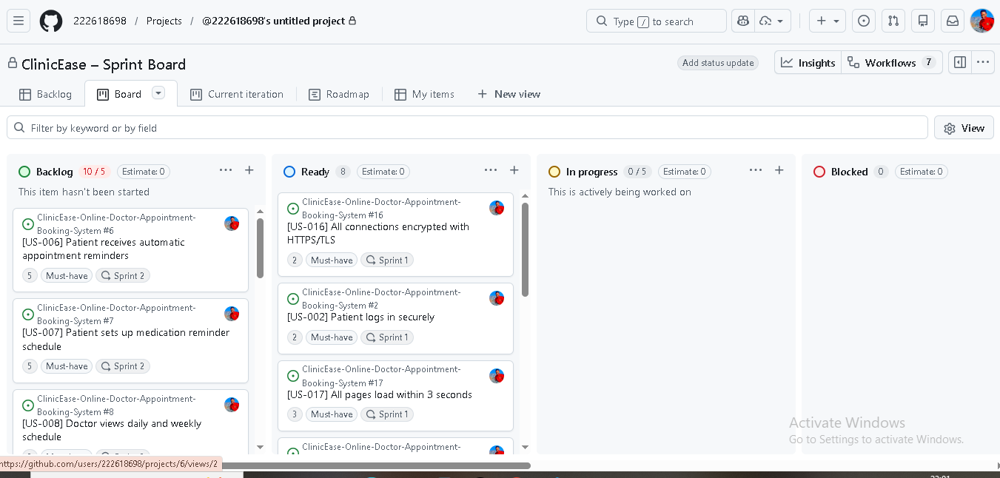

# 🏥 ClinicEase – Online Doctor Appointment Booking System

## Project Description

**ClinicEase** is a web-based clinic appointment booking system designed to simplify how patients schedule, manage, and track their medical care — all from their phone or computer. The system connects patients with doctors at local clinics, allowing online booking, cancellations, and smart reminders, eliminating the need for long queues, paper folders, and phone-based scheduling.

### 🌍 The Problem It Solves

In many South African clinics, patients carry thick paper files, wait in long queues just to be seen, and often forget when to take their medication or when their next appointment is. ClinicEase replaces all of that with a smart, paperless digital system.

### ✅ What ClinicEase Will Do

**📅 Online Appointment Booking**
Patients who are feeling sick can book an appointment from home before even leaving the house — no more arriving at the clinic and waiting for hours just to get a slot. Book your time, arrive when it's your turn, and go home faster.

**💊 Medication Reminders**
The system will send the patient a notification reminding them when it is time to take their medication. No more forgetting doses — whether it is morning tablets, afternoon pills, or chronic medication that must be taken every day.

**🩸 Procedure & Test Reminders**
If a patient needs to come back to the clinic for blood tests, blood pressure checks, or any follow-up procedure, the system will automatically notify them when their next test is due. For example: *"Your next blood draw is scheduled for Friday at 9AM — please fast from midnight."*

**📂 Paperless Patient Records**
Instead of carrying a paper file every visit, all patient information — diagnosis history, medication prescribed, test results, and appointment records — is stored digitally in the system. This reduces lost files, saves time at the reception desk, and makes it easier for doctors to view a patient's history instantly.

**🔔 Smart Notifications**
Patients receive reminders for:
- Upcoming appointments (24 hours and 1 hour before)
- Medication times throughout the day
- Follow-up procedures like blood tests or injections
- When chronic medication is about to run out and needs a refill

**👨‍⚕️ Doctor & Receptionist Dashboard**
Doctors can view their full daily schedule digitally, update patient notes after each visit, and flag patients who need follow-up care. Receptionists can manage the queue, add walk-in patients, and reschedule appointments — all without touching a paper file.

---

## 📁 Project Structure

```
ClinicEase-Online-Doctor-Appointment-Booking-System/
│
├── src/                                  # Core domain classes
│   ├── __init__.py
│   ├── user.py                           # Base User class
│   ├── users.py                          # Patient, Doctor, Receptionist, Administrator
│   └── models.py                         # Appointment, TimeSlot, Notification, MedicalRecord, MedicationReminder
│
├── creational_patterns/                  # All 6 creational design patterns
│   ├── __init__.py
│   └── patterns.py                       # Simple Factory, Factory Method, Abstract Factory, Builder, Prototype, Singleton
│
├── repositories/                         # Repository layer (Assignment 11)
│   ├── __init__.py
│   ├── interfaces.py                     # Generic + entity-specific repository interfaces
│   ├── inmemory/
│   │   ├── __init__.py
│   │   └── implementations.py            # In-memory HashMap CRUD implementations
│   ├── filesystem/
│   │   ├── __init__.py
│   │   └── implementations.py            # JSON filesystem stubs (future)
│   └── database/
│       ├── __init__.py
│       └── implementations.py            # PostgreSQL stubs (future)
│
├── factories/                            # Storage abstraction
│   ├── __init__.py
│   └── repository_factory.py             # RepositoryFactory — switches between MEMORY/FILESYSTEM/DATABASE
│
├── tests/                                # All unit tests
│   ├── __init__.py
│   ├── test_all.py                       # 69 tests — creational patterns + core classes
│   └── test_repositories.py              # 47 tests — repository CRUD + factory
│
└── setup.cfg                             # pytest configuration
```

---
## 📂 Project Documents

### Assignment 3 — System Specification & Architecture
| Document | Description |
|---|---|
| [SPECIFICATION.md](./SPECIFICATION.md) | Full system specification including domain, problem statement, scope, and requirements |
| [ARCHITECTURE.md](./ARCHITECTURE.md) | C4 architectural diagrams: Context, Container, Component, Code levels + Data Flow Diagram |

### Assignment 4 — Stakeholder & System Requirements
| Document | Description |
|---|---|
| [STAKEHOLDERS.md](./STAKEHOLDERS.md) | 7 stakeholders with detailed roles, concerns, pain points, and success metrics |
| [SRD.md](./SRD.md) | System Requirements Document — 12 functional + 14 non-functional requirements with acceptance criteria |
| [REFLECTION.md](./REFLECTION.md) | Challenges faced in balancing stakeholder needs during requirements elicitation |

### Assignment 5 — Use Case Modelling & Test Cases
| Document | Description |
|---|---|
| [USE_CASE_DIAGRAM.md](./USE_CASE_DIAGRAM.md) | UML use case diagram (Mermaid) with 7 actors, 19 use cases, include relationships and written explanation |
| [USE_CASE_SPECS.md](./USE_CASE_SPECS.md) | 8 detailed use case specifications with preconditions, postconditions, basic and alternative flows |
| [TEST_CASES.md](./TEST_CASES.md) | 15 functional test cases + 3 non-functional test cases (performance, security, scalability) |
| [REFLECTION_A5.md](./REFLECTION_A5.md) | Challenges in translating requirements into use cases and test cases |

### Assignment 6 — Agile Planning, Backlog & Sprint
| Document | Description |
|---|---|
| [AGILE_PLANNING.md](./AGILE_PLANNING.md) | 18 user stories, MoSCoW backlog, Sprint 1 goal, task breakdown, and GitHub setup guide |
| [REFLECTION_A6.md](./REFLECTION_A6.md) | Challenges in Agile prioritisation, estimation, and playing dual Scrum roles solo |

### Assignment 7 — GitHub Kanban Board
| Document | Description |
|---|---|
| [template_analysis.md](./template_analysis.md) | Comparison of 4 GitHub templates with justification for Team Planning selection |
| [kanban_explanation.md](./kanban_explanation.md) | Kanban board definition, column structure, WIP limits, and Agile alignment |
| [KANBAN_SETUP.md](./KANBAN_SETUP.md) | Step-by-step guide to setting up the GitHub Project board with custom columns and fields |
| [reflection.md](./reflection.md) | Lessons learned in template selection and comparison with Trello and Jira |

### Assignment 8 — State and Activity Modeling
| Document | Description |
|---|---|
| [STATE_DIAGRAMS.md](./STATE_DIAGRAMS.md) | 7 UML state transition diagrams (Appointment, User Account, Doctor Profile, Time Slot, Medication Reminder, Patient Record, Notification) |
| [ACTIVITY_DIAGRAMS.md](./ACTIVITY_DIAGRAMS.md) | 8 UML activity diagrams with swimlanes (Registration, Booking, Cancellation, Reminder, Medication, Consultation, Walk-in, Admin Reports) |
| [a8_reflection.md](./a8_reflection.md) | Lessons learned in state vs activity modeling, granularity, and Agile alignment |

### Assignment 9 — Domain Model and Class Diagram
| Document | Description |
|---|---|
| [DOMAIN_MODEL.md](./DOMAIN_MODEL.md) | 8 domain entities with attributes, methods, relationships, and business rules |
| [CLASS_DIAGRAM.md](./CLASS_DIAGRAM.md) | Full Mermaid.js class diagram with 11 classes, inheritance, composition, aggregation, and multiplicity |
| [a9_reflection.md](./a9_reflection.md) | Reflection on OOP design decisions, trade-offs, and alignment with prior assignments |

### Assignment 10 — Code Implementation and Creational Patterns
| Document/Directory | Description |
|---|---|
| [src/](./src/) | Core class implementations: `user.py`, `users.py`, `models.py` |
| [creational_patterns/](./creational_patterns/) | All 6 creational patterns in `patterns.py` |
| [tests/](./tests/) | 69 unit tests in `test_all.py` — all passing, 88% coverage |
| [CHANGELOG.md](./CHANGELOG.md) | Full project changelog across all assignments |

---

## 🗄️ Repository Layer (Assignment 11)

The repository layer abstracts all storage details behind interfaces, allowing the storage backend to be swapped without changing any business logic.

| Layer | Pattern Used | Purpose |
|---|---|---|
| `interfaces.py` | Generic interface `Repository<T,ID>` | Defines CRUD contract for all entities |
| `inmemory/` | HashMap / Python dict | Fast in-memory storage for development and testing |
| `filesystem/` | JSON file serialisation | Future: persist data to disk between sessions |
| `database/` | PostgreSQL via psycopg2 | Future: production-grade persistent storage |
| `repository_factory.py` | Factory Pattern | Switch backends via `RepositoryFactory.get_patient_repository("MEMORY")` |

**Justification:** The Factory Pattern was chosen over Dependency Injection because it provides a single centralised switching point. Adding a new backend (e.g. MongoDB) requires only adding one new case in the factory — zero changes to services, controllers, or tests.

---

### Assignment 12 — Service Layer and REST API
| Document/Directory | Description |
|---|---|
| [services/patient_service.py](./services/patient_service.py) | PatientService — register, get, update, delete with business rule validation |
| [services/doctor_service.py](./services/doctor_service.py) | DoctorService — create, search by specialisation, set available/unavailable |
| [services/appointment_service.py](./services/appointment_service.py) | AppointmentService — book, cancel, reschedule, complete with double-booking prevention |
| [api/main.py](./api/main.py) | FastAPI REST API — 20 endpoints for Patients, Doctors, and Appointments with Swagger UI |
| [tests/test_services.py](./tests/test_services.py) | 40 service layer unit tests — all passing |
| [tests/test_api.py](./tests/test_api.py) | 32 API integration tests — all passing |
| [conftest.py](./conftest.py) | pytest path configuration for all test modules |

---

## 🚀 Running the REST API

```bash
# Install dependencies
pip install fastapi uvicorn httpx

# Start the API server
uvicorn api.main:app --reload
```

Then open **http://localhost:8000/docs** in your browser for the interactive Swagger UI.

### 📋 Available Endpoints

| Method | Endpoint | Description |
|---|---|---|
| GET | `/api/patients` | Get all patients |
| POST | `/api/patients` | Register a new patient |
| GET | `/api/patients/{id}` | Get patient by ID |
| PUT | `/api/patients/{id}` | Update patient details |
| DELETE | `/api/patients/{id}` | Delete a patient |
| GET | `/api/doctors` | Get all doctors |
| POST | `/api/doctors` | Create a doctor profile |
| GET | `/api/doctors/available` | Get available doctors only |
| GET | `/api/doctors/search?specialisation=GP` | Search by specialisation |
| GET | `/api/doctors/{id}` | Get doctor by ID |
| PUT | `/api/doctors/{id}` | Update doctor profile |
| PATCH | `/api/doctors/{id}/unavailable` | Set doctor unavailable |
| PATCH | `/api/doctors/{id}/available` | Set doctor available |
| DELETE | `/api/doctors/{id}` | Delete doctor profile |
| POST | `/api/slots` | Create a time slot for a doctor |
| GET | `/api/doctors/{id}/slots` | Get available slots for a doctor |
| GET | `/api/appointments` | Get all appointments |
| POST | `/api/appointments` | Book an appointment |
| GET | `/api/appointments/{id}` | Get appointment by ID |
| PATCH | `/api/appointments/{id}/cancel` | Cancel an appointment |
| PATCH | `/api/appointments/{id}/reschedule` | Reschedule an appointment |
| PATCH | `/api/appointments/{id}/complete` | Complete an appointment |

---

## 🧪 Running ALL Tests

```bash
# Install all dependencies
pip install bcrypt pytest pytest-cov fastapi uvicorn httpx

# Run ALL tests (188 total)
python -m pytest tests/ -v

# Run by assignment
python -m pytest tests/test_all.py -v                  # Assignment 10 — 69 tests
python -m pytest tests/test_repositories.py -v         # Assignment 11 — 47 tests
python -m pytest tests/test_services.py -v             # Assignment 12 — 40 tests
python -m pytest tests/test_api.py -v                  # Assignment 12 — 32 tests

# Run with full coverage
python -m pytest tests/ --cov=src --cov=creational_patterns --cov=repositories --cov=factories --cov=services --cov=api --cov-report=term-missing
```

### ✅ Full Test Results

| Test File | Tests | Assignment | Status |
|---|---|---|---|
| `tests/test_all.py` | 69 | Assignment 10 — Creational Patterns | ✅ All passing |
| `tests/test_repositories.py` | 47 | Assignment 11 — Repository Layer | ✅ All passing |
| `tests/test_services.py` | 40 | Assignment 12 — Service Layer | ✅ All passing |
| `tests/test_api.py` | 32 | Assignment 12 — REST API | ✅ All passing |
| **Total** | **188** | | **✅ 188 passing** |

## 🧪 Running the Tests

```bash
# Install dependencies
pip install bcrypt pytest pytest-cov

# Run ALL tests (116 total)
python -m pytest tests/ -v

# Run with full coverage report
python -m pytest tests/ --cov=src --cov=creational_patterns --cov=repositories --cov=factories --cov-report=term-missing

# Run only repository tests
python -m pytest tests/test_repositories.py -v

# Run only creational pattern tests
python -m pytest tests/test_all.py -v
```

## 🏗️ Creational Patterns Used

| Pattern | Class | Use Case |
|---|---|---|
| Simple Factory | `UserFactory` | Creates Patient/Doctor/Receptionist/Admin by role string |
| Factory Method | `NotificationCreator` + subclasses | Creates correct notification type with right message |
| Abstract Factory | `StandardSchedulingFactory` / `UrgentSchedulingFactory` | Creates matching slot + appointment families |
| Builder | `MedicalRecordBuilder` | Builds complex records step by step |
| Prototype | `MedicationReminderPrototype` | Clones pre-configured medication templates |
| Singleton | `DatabaseConnection` | One thread-safe DB connection across the app |

### Assignment 13 — CI/CD with GitHub Actions
| Document/Directory | Description |
|---|---|
| [.github/workflows/ci.yml](./.github/workflows/ci.yml) | Full CI/CD pipeline — runs 188 tests on every push, blocks PR if tests fail, builds wheel artifact on merge to main |
| [PROTECTION.md](./PROTECTION.md) | Branch protection rules explanation — why each rule matters for code quality |

---

## ⚙️ CI/CD Pipeline

ClinicEase uses GitHub Actions for automated testing and deployment.

### How it Works

```
Every push / PR to main
        ↓
🧪 Job 1: Run All Tests (188 tests)
        ↓
🔍 Job 2: Code Quality Check
        ↓
  Tests pass? ──── NO ──→ ❌ PR blocked — cannot merge
        │
       YES
        ↓
📦 Job 3: Build & Release (main branch only)
        ↓
  Python wheel built → uploaded as GitHub Release artifact
```

### Pipeline Jobs

| Job | Trigger | Purpose |
|---|---|---|
| 🧪 Run All Tests | Every push + PR | Runs all 188 tests, uploads results and coverage as artifacts |
| 🔍 Code Quality Check | Every push + PR | Checks syntax errors, verifies all modules import correctly |
| 📦 Build and Release | Merge to main only | Builds Python wheel, creates GitHub Release with artifact attached |

### Branch Protection Rules on `main`
- ✅ Pull request required before merging (no direct pushes)
- ✅ At least 1 reviewer approval required
- ✅ CI status checks must pass before merge
- ✅ Branch must be up to date with main
- ✅ Admins cannot bypass rules

See [PROTECTION.md](./PROTECTION.md) for full justification.

---

## 🚀 Getting Started

```bash
# 1. Clone the repository
git clone https://github.com/222618698/ClinicEase-Online-Doctor-Appointment-Booking-System.git
cd ClinicEase-Online-Doctor-Appointment-Booking-System

# 2. Install dependencies
pip install bcrypt pytest pytest-cov fastapi uvicorn httpx pydantic

# 3. Run all tests (should show 188 passing)
python -m pytest tests/ -v

# 4. Start the API server
uvicorn api.main:app --reload
# Open http://localhost:8000/docs for Swagger UI
```

---

## 🤝 Contributing

We welcome contributions! Please read [CONTRIBUTING.md](./CONTRIBUTING.md) before submitting a PR.

### Features Available for Contribution

| Feature | Difficulty | Label | File to Edit |
|---|---|---|---|
| Add medication search endpoint | Beginner | `good-first-issue` | `api/main.py` |
| Add test for caregiver linking | Beginner | `good-first-issue` | `tests/test_services.py` |
| Add doctor rating system | Beginner | `good-first-issue` | `services/doctor_service.py` |
| Add appointment history endpoint | Beginner | `good-first-issue` | `api/main.py` |
| Add patient profile photo upload | Beginner | `good-first-issue` | `services/patient_service.py` |
| PostgreSQL database integration | Intermediate | `feature-request` | `repositories/database/` |
| JWT authentication | Intermediate | `feature-request` | `api/main.py` |
| React.js frontend | Advanced | `feature-request` | New directory |

See [ROADMAP.md](./ROADMAP.md) for the full list of planned features.

---

## 📄 License

This project is licensed under the **MIT License** — see [LICENSE](./LICENSE) for details.

### Assignment 14 — Open Source Collaboration
| Document | Description |
|---|---|
| [CONTRIBUTING.md](./CONTRIBUTING.md) | Setup instructions, coding standards, and PR guide for contributors |
| [ROADMAP.md](./ROADMAP.md) | Planned features across 5 development phases |
| [LICENSE](./LICENSE) | MIT License |
| [VOTING_RESULTS.md](./VOTING_RESULTS.md) | Peer engagement — stars, forks, and feedback |
| [REFLECTION_A14.md](./REFLECTION_A14.md) | 720-word reflection on open-source collaboration |

## 📊 Kanban Board > See the live board on the [GitHub Projects tab](../../projects)  ClinicEase uses a customised GitHub Project board based on the

## 🛠️ Tech Stack (Planned)

- **Frontend:** React.js
- **Backend:** Node.js + Express
- **Database:** PostgreSQL
- **Authentication:** JWT + bcrypt
- **Notifications:** Nodemailer (SMTP)
- **Hosting:** Render / Railway

---

## 👤 Author

**[Sithembiso Lungisani Mthembu]**
Student Number: [222618698]
Cape Peninsula University of Technology
Module: Software Engineering – Assignment 3
Date: March 2026

