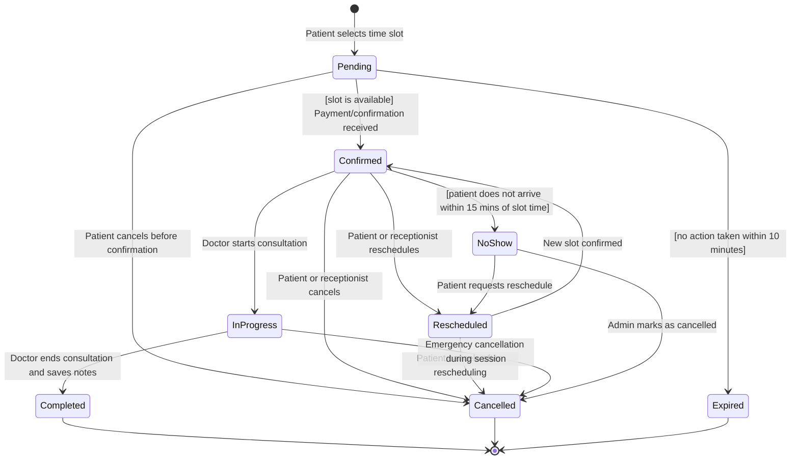
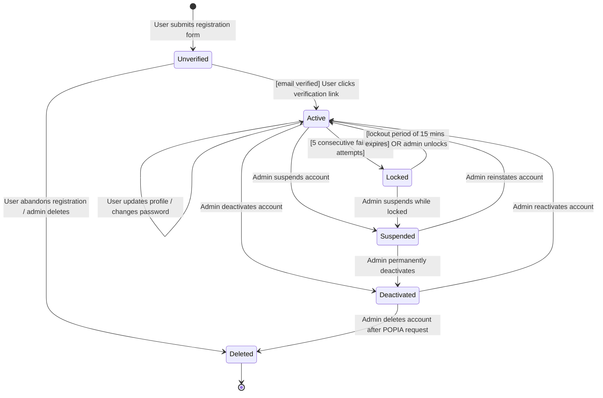
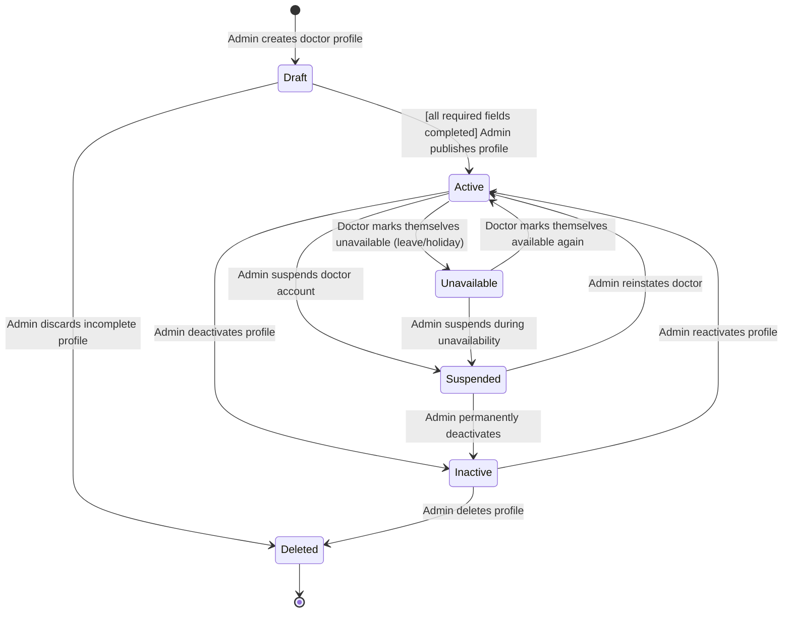
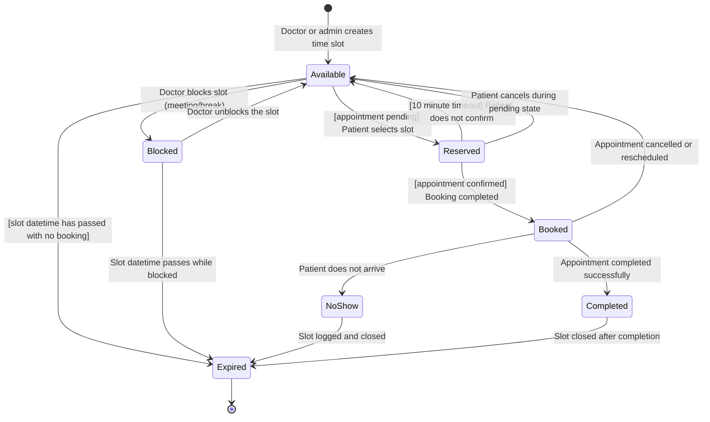
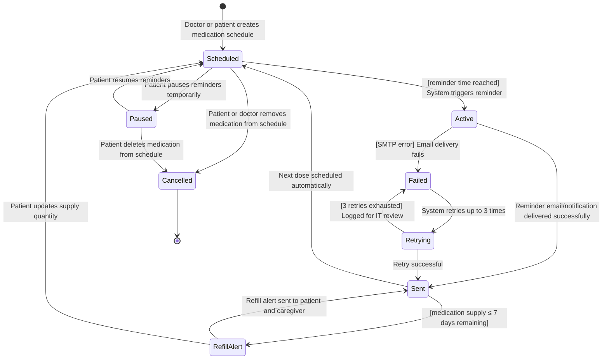
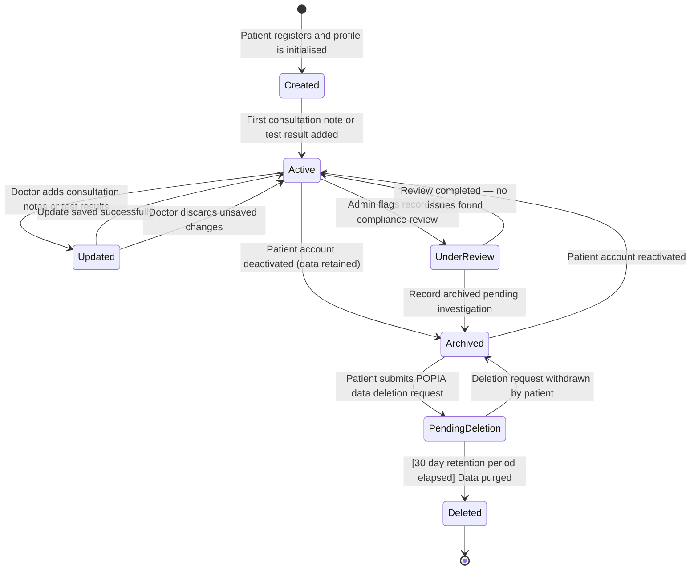
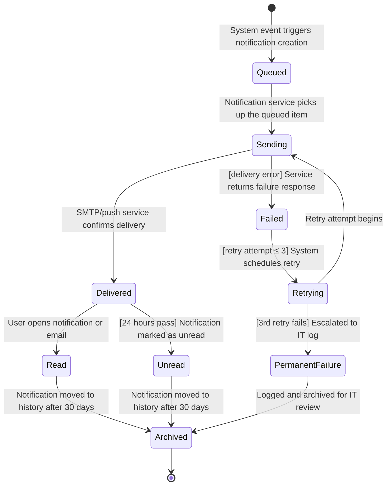

# STATE_DIAGRAMS.md – Object State Modeling

## ClinicEase Online Doctor Appointment Booking System

---

## Overview

This document models the lifecycle of 7 critical objects in the ClinicEase system using UML state transition diagrams written in Mermaid. Each diagram shows the states an object can be in, the events that trigger transitions between states, and any guard conditions that apply.

---

## Object 1: Appointment

### State Diagram

### Explanation

| State | Description |
|---|---|
| **Pending** | Appointment created but not yet confirmed. Slot is temporarily held. |
| **Confirmed** | Slot is locked. Reminders are scheduled. Patient and doctor are notified. |
| **Rescheduled** | Original slot released. New slot being selected. |
| **InProgress** | Doctor has started the consultation. |
| **Completed** | Consultation finished. Notes saved. Records updated. |
| **NoShow** | Patient did not arrive. Slot is logged for reporting. |
| **Cancelled** | Appointment terminated. Slot released immediately. |
| **Expired** | Pending appointment not confirmed within 10 minutes. Slot released. |

**Traceability:**
- Confirmed state → FR-03 (Book Appointment)
- Cancelled transition → FR-04 (Cancel/Reschedule)
- Reminders triggered from Confirmed → FR-05 (Appointment Reminders)
- NoShow state → FR-11 (Admin Reports — no-show rate)
- US-004, US-005, US-006 | UC-03, UC-04

---

## Object 2: User Account

### State Diagram

### Explanation

| State | Description |
|---|---|
| **Unverified** | Account created but email not yet confirmed. |
| **Active** | Full system access granted based on assigned role. |
| **Locked** | Temporary lock after 5 failed login attempts. Auto-unlocks after 15 minutes. |
| **Suspended** | Admin has suspended the account pending investigation. |
| **Deactivated** | Account disabled but data retained for audit purposes. |
| **Deleted** | All personal data removed in compliance with POPIA. |

**Traceability:**
- Active state → FR-01 (User Registration and Login)
- Locked transition → NFR-SEC1 (Security — brute force protection)
- Deleted state → NFR-SEC3 (POPIA compliance — right to erasure)
- US-001, US-002, US-015 | UC-01

---

## Object 3: Doctor Profile

### State Diagram

### Explanation

| State | Description |
|---|---|
| **Draft** | Profile created but not yet visible to patients. |
| **Active** | Doctor is visible in search results and can receive bookings. |
| **Unavailable** | Doctor temporarily not accepting bookings (e.g., on leave). |
| **Suspended** | Account under review. No new bookings accepted. |
| **Inactive** | Profile disabled. Not visible to patients. |
| **Deleted** | Profile permanently removed from the system. |

**Traceability:**
- Active state → FR-02 (Doctor Search)
- Unavailable state → FR-03 (Slot Availability Check)
- US-003, US-008 | UC-02, UC-07

---

## Object 4: Time Slot

### State Diagram

### Explanation

| State | Description |
|---|---|
| **Available** | Slot is open and visible to patients for booking. |
| **Reserved** | Temporarily held for a patient completing their booking. |
| **Booked** | Slot is confirmed and locked to a specific appointment. |
| **Blocked** | Doctor has manually blocked the slot — not available to patients. |
| **Completed** | The appointment in this slot finished successfully. |
| **NoShow** | Patient did not attend — slot is logged and then expired. |
| **Expired** | Slot datetime has passed. Removed from active availability. |

**Traceability:**
- Available → Reserved → Booked → FR-03 (Booking with slot check)
- Available release on cancel → FR-04 (Cancellation)
- Reserved timeout → NFR-P2 (Performance — fast slot release)
- US-004, US-005 | UC-03, UC-04, UC-18

---

## Object 5: Medication Reminder

### State Diagram

### Explanation

| State | Description |
|---|---|
| **Scheduled** | Reminder is set and waiting for the trigger time. |
| **Active** | Trigger time reached. Reminder being dispatched. |
| **Sent** | Reminder successfully delivered. Next dose automatically scheduled. |
| **Failed** | Delivery failed. System enters retry cycle. |
| **Retrying** | System attempting redelivery up to 3 times. |
| **RefillAlert** | Supply running low. Special refill alert dispatched. |
| **Paused** | Patient temporarily suspended reminders. |
| **Cancelled** | Medication removed from schedule entirely. |

**Traceability:**
- Scheduled → Sent → FR-06 (Medication Reminder System)
- RefillAlert state → FR-06 acceptance criteria (7-day refill alert)
- Failed → Retrying → NFR-SEC1 (system reliability)
- US-007 | UC-06

---

## Object 6: Patient Medical Record

### State Diagram

### Explanation

| State | Description |
|---|---|
| **Created** | Empty record initialised on patient registration. |
| **Active** | Record is live and being updated by doctors. |
| **Updated** | Transient state during a save operation. Returns to Active. |
| **Archived** | Record preserved but not actively updated. |
| **UnderReview** | Flagged by admin for compliance or audit review. |
| **PendingDeletion** | Patient has requested data removal under POPIA. |
| **Deleted** | All personal data permanently removed. |

**Traceability:**
- Active → Updated → FR-10 (Paperless Patient Records)
- PendingDeletion → Deleted → NFR-SEC3 (POPIA Compliance)
- US-010 | UC-07

---

## Object 7: Notification

### State Diagram

### Explanation

| State | Description |
|---|---|
| **Queued** | Notification created and waiting to be dispatched. |
| **Sending** | Active dispatch attempt in progress. |
| **Delivered** | Confirmed delivery by the email/push service. |
| **Failed** | Delivery attempt failed. Retry cycle begins. |
| **Retrying** | Retry in progress. Maximum 3 retries. |
| **PermanentFailure** | All retries exhausted. IT staff alerted via log. |
| **Read** | User has opened the notification. |
| **Unread** | Delivered but not yet opened after 24 hours. |
| **Archived** | Notification moved to history log after 30 days. |

**Traceability:**
- Queued → Delivered → FR-05 (Appointment Reminders), FR-06 (Medication Reminders)
- Failed → Retrying → NFR-P3 (Cron job reliability)
- PermanentFailure → NFR-M1 (IT logging and monitoring)
- US-006, US-007, US-009 | UC-05, UC-06

---

## Traceability Summary

| Object | Key States | Functional Requirement | User Story |
|---|---|---|---|
| Appointment | Pending → Confirmed → Completed | FR-03, FR-04, FR-05 | US-004, US-005, US-006 |
| User Account | Unverified → Active → Locked | FR-01, NFR-SEC1, NFR-SEC3 | US-001, US-002, US-015 |
| Doctor Profile | Draft → Active → Unavailable | FR-02, FR-08 | US-003, US-008 |
| Time Slot | Available → Reserved → Booked | FR-03, FR-04, NFR-P2 | US-004, US-005 |
| Medication Reminder | Scheduled → Sent → RefillAlert | FR-06 | US-007 |
| Patient Medical Record | Created → Active → PendingDeletion | FR-10, NFR-SEC3 | US-010 |
| Notification | Queued → Delivered → Archived | FR-05, FR-06, NFR-P3 | US-006, US-007, US-009 |

---

*Document prepared by: [Sithembiso Mthembu] | [222618698] | CPUT | March 2026*