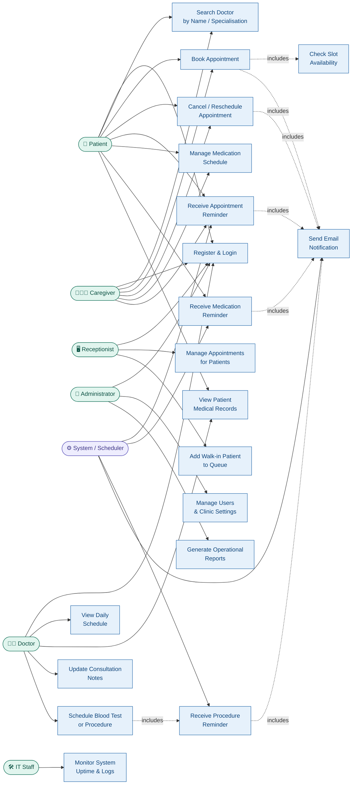

# USE_CASE_DIAGRAM.md – ClinicEase Use Case Diagram

---

## Use Case Diagram (Mermaid)

---

## Written Explanation

### Key Actors and Their Roles

| Actor | Role in the System |
|---|---|
| **Patient** | The primary user. Registers, searches for doctors, books and cancels appointments, manages medication schedules, and views medical records. |
| **Caregiver** | Books and manages appointments on behalf of a dependent patient. Can manage medication reminders and receive notifications. Shares most use cases with the Patient. |
| **Doctor** | Views their daily schedule, accesses patient medical history, updates consultation notes, and schedules follow-up procedures like blood tests. |
| **Receptionist** | Manages appointments on behalf of patients, adds walk-in patients to the queue, and handles rescheduling at the front desk. |
| **Administrator** | Manages all user accounts, clinic settings, and generates operational reports. Has full system access. |
| **IT Staff** | Monitors system uptime, reviews error logs, and ensures the system is running correctly. Does not interact with patient-facing features. |
| **System / Scheduler** | An automated actor representing the cron job that triggers appointment reminders, medication reminders, and procedure alerts without human input. |

---

### Relationships Between Actors and Use Cases

**Inclusion relationships (`includes`):**
- **Book Appointment** includes **Check Slot Availability** — before a booking is confirmed, the system must verify the slot is still open. This prevents double-booking (FR-03).
- **Book Appointment** and **Cancel/Reschedule Appointment** both include **Send Email Notification** — every booking action triggers an automated email to the patient (FR-03, FR-04).
- **Receive Appointment Reminder**, **Receive Medication Reminder**, and **Receive Procedure Reminder** all include **Send Email Notification** — reminders are always delivered via email (FR-05, FR-06, FR-07).
- **Schedule Blood Test or Procedure** includes **Receive Procedure Reminder** — when a doctor schedules a procedure, it automatically creates a future reminder (FR-07, FR-08).

**Generalisation:**
- The **Caregiver** actor shares the registration, search, booking, and reminder use cases with the **Patient** actor, because caregivers perform these actions on behalf of patients. This reflects the stakeholder concern from Assignment 4 that caregivers need the same booking capabilities as patients.

---

### How the Diagram Addresses Stakeholder Concerns from Assignment 4

| Stakeholder | Concern from Assignment 4 | Use Case(s) Addressing It |
|---|---|---|
| Patient | Book appointments without visiting the clinic | UC2, UC3 |
| Patient | Never miss medication or procedure | UC6, UC7, UC9 |
| Patient | No more paper files | UC10 |
| Doctor | Real-time view of daily schedule | UC11 |
| Doctor | Access patient history before consultation | UC10, UC12 |
| Receptionist | Fast appointment management and walk-ins | UC13, UC14 |
| Administrator | Control user access and generate reports | UC15, UC16 |
| IT Staff | Monitor system health | UC17 |
| Caregiver | Manage a dependent's appointments remotely | UC2, UC3, UC4, UC6 |
| System/Scheduler | Automate all reminder notifications | UC5, UC7, UC9, UC19 |

---

*Document prepared by: [Your Full Name] | [Your Student Number] | CPUT | March 2026*